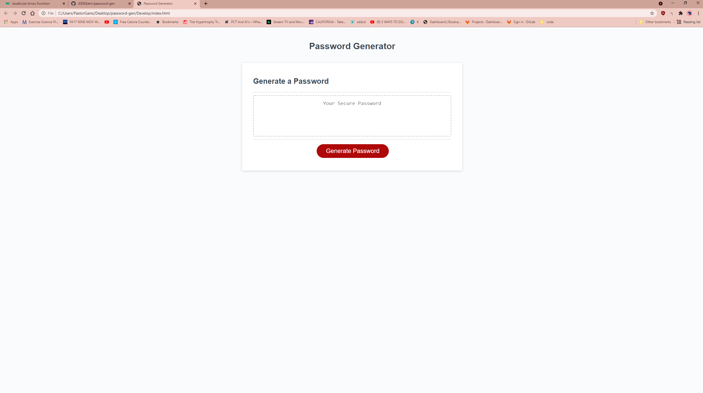
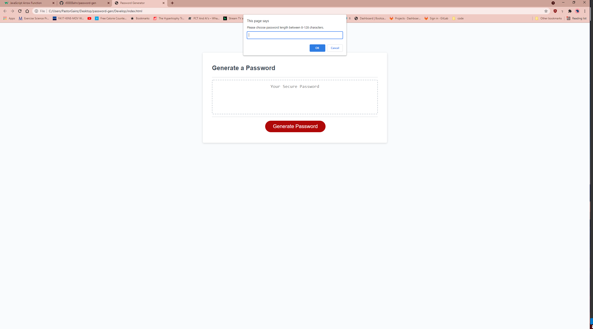
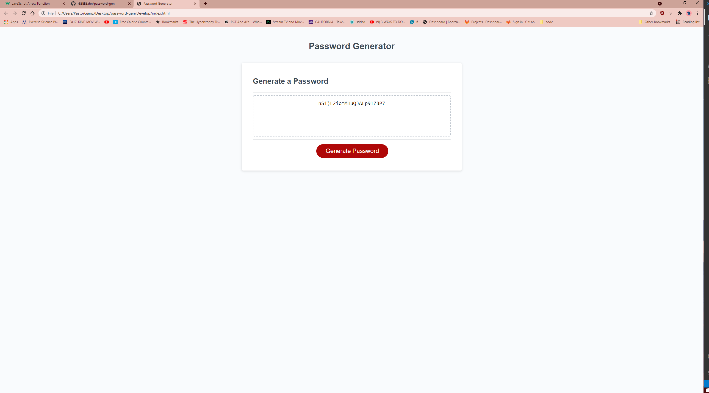

# <Password Generator>
## Description
Homework 3 is all about javascript. my task was to write the javascript for a password generator; html and css already provided.
## Installation
Writing the javascript was tough for me. I had to really depend on google and past classwork to get through this. I have to admit, I did restart towards the end of my first try because i just could nto get the generator to work. I figured that it might be easier to restart instead of trying to debug the code. psuedocode was very helpful as well to get things rolling.
## Usage

Password Generator. HTML and CSS provided.

prompt will pop up and password question will appear. ex: would you like uppercase in the password.

End result!

## License
Copyright (c) [2021] [Ryan Hsiao]

Permission is hereby granted, free of charge, to any person obtaining a copy
of this software and associated documentation files (the "Software"), to deal
in the Software without restriction, including without limitation the rights
to use, copy, modify, merge, publish, distribute, sublicense, and/or sell
copies of the Software, and to permit persons to whom the Software is
furnished to do so, subject to the following conditions:

The above copyright notice and this permission notice shall be included in all
copies or substantial portions of the Software.

THE SOFTWARE IS PROVIDED "AS IS", WITHOUT WARRANTY OF ANY KIND, EXPRESS OR
IMPLIED, INCLUDING BUT NOT LIMITED TO THE WARRANTIES OF MERCHANTABILITY,
FITNESS FOR A PARTICULAR PURPOSE AND NONINFRINGEMENT. IN NO EVENT SHALL THE
AUTHORS OR COPYRIGHT HOLDERS BE LIABLE FOR ANY CLAIM, DAMAGES OR OTHER
LIABILITY, WHETHER IN AN ACTION OF CONTRACT, TORT OR OTHERWISE, ARISING FROM,
OUT OF OR IN CONNECTION WITH THE SOFTWARE OR THE USE OR OTHER DEALINGS IN THE
SOFTWARE.
---
